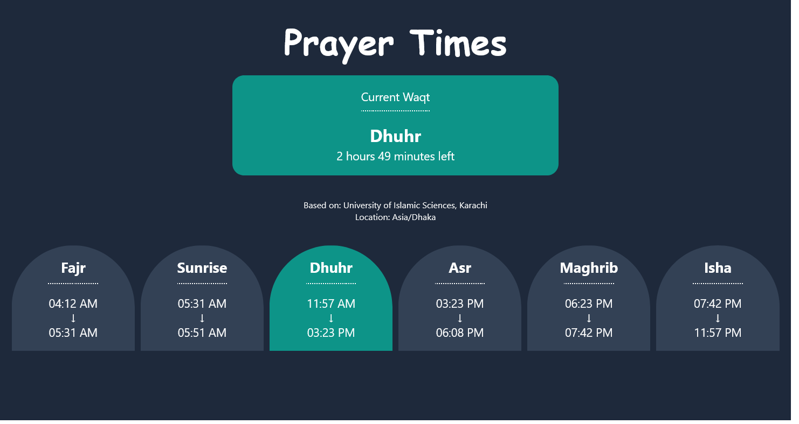

<div align="center">

  

  <h2>Prayer Times</h2>

  <h3>
    <a href="https://prayer-times-alamin.vercel.app">
      <strong>View Demo 🚀</strong>
    </a>
  </h3>

  <div align="center">
    <a href="https://github.com/CodePapa360/PrayerTimes/issues">Report Bug</a>
    •
    <a href="https://github.com/CodePapa360/PrayerTimes/pulls">Request Feature</a>
  </div>

  <hr>

</div>

<!-- Badges -->
<div align="center">


<a href='https://www.twitter.com/CodePapa360' target="_blank"></a>
<a href='https://www.linkedin.com/in/codepapa360' target="_blank"></a>

</div>

<!-- Brief -->
<p align="center">
"Prayer Times" is a simple web application that provides prayer times based on the user's location. It utilizes the Geolocation API to determine the user's location and the <a href="https://aladhan.com/prayer-times-api">Aladhan Prayer times API</a> Aladhan Prayer times API to fetch the corresponding prayer times.
</p>

<!-- Screenshot -->
<a align="center" href="https://prayer-times-alamin.vercel.app">



</a>

## Table of contents

- [Key Features](#key-features)
- [Built with](#built-with)
- [Installation](#installation)
- [Author](#author)

## Key Features

- Give me the list of the key features of this app.
- Uses the Geolocation API to determine the user's location.
- Uses the [Aladhan Prayer times API](https://aladhan.com/prayer-times-api) to fetch the corresponding prayer times.
- Displays the current prayer with remaining time.

## Built with

- React
- TailwindCSS
- [Aladhan Prayer times API](https://aladhan.com/prayer-times-api)
- Vite

## Installation

- Clone this repo:

```sh
git clone https://github.com/CodePapa360/PrayerTimes.git
```

- Install dependencies:

```sh
npm install
```

- Build command:

```sh
npm run build
```

- Live server:

```sh
npm run dev
```

### Author

<b>👤 Alamin</b>

- Twitter : [@CodePapa360](https://www.twitter.com/CodePapa360)
- LinkedIn : [@CodePapa360](https://www.linkedin.com/in/codepapa360)
- Frontend Mentor : [@CodePapa360](https://www.frontendmentor.io/profile/CodePapa360)

Feel free to contact me with any questions or feedback!
